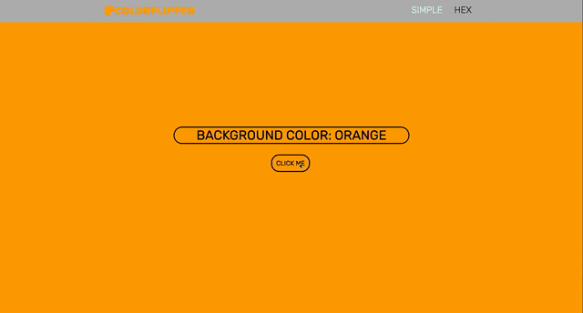

# Color Flipper

A one page application that allows the user to generate a random color.

## Features

- Page defaults to Simple mode which allows the user to generate a color from a preselected array of colors.
- Hex mode allows the user to generate a truly random hex code.
- Both background and site logo color update according to the color generated. 

### Deployed via Netlify [here.](https://color-flipper-mp.netlify.app/)

